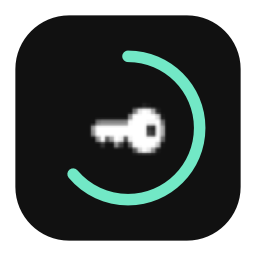
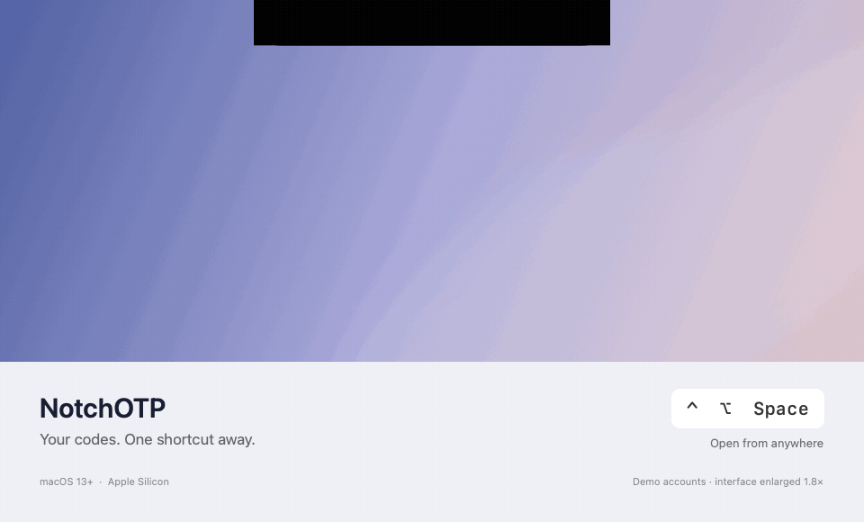

<p align="center">
  
</p>
<h1 align="center">NotchOTP</h1>
<p align="center">Your two-factor codes, one shortcut away.</p>
<p align="center">
  <a href="https://github.com/Photon94/NotchOTP/actions/workflows/ci.yml"></a>
  
  
</p>
<p align="center"><a href="docs/README.ru.md">Русский</a> · <a href="#get-started">Get started</a> · <a href="#keyboard-controls">Keyboard controls</a> · <a href="#development">Development</a></p>

A small, native TOTP authenticator for macOS. Press **Control + Option + Space** and a black panel flows down from your MacBook's notch, showing the current code and a circular countdown.

The panel matches the physical notch width. Type to search, use Tab to switch accounts, and press Enter to copy. No browser, cloud service, or external packages are involved. The current app interface is in Russian.

## Preview



Animated preview rendered from the app’s SwiftUI views using public demo accounts; interface enlarged for readability. [Still preview](docs/assets/notchotp-preview.png) · [Account search](docs/assets/notchotp-search.png).

## Features

- **Notch-sized panel** with a downward reveal and reverse closing animation; respects Reduce Motion.
- **Keyboard-first navigation:** a configurable global shortcut, account switching, search, and copy.
- **Live TOTP codes:** SHA-1, SHA-256, or SHA-512; 6 or 8 digits; configurable period.
- **Local Keychain storage** for account metadata and secrets.
- **Manual setup, `otpauth://` links, or QR image import** using Apple Vision.
- **Multiple displays:** opens on the display containing the pointer, with a top-centred fallback on displays without a notch.
- **Menu bar access:** closing the settings window keeps the app available.

## Get started

[**Download NotchOTP 0.2.0 for Apple Silicon**](https://github.com/Photon94/NotchOTP/releases/tag/v0.2.0)

Download the DMG from the release, open it, and drag **NotchOTP.app** onto **Applications**. A ZIP is also available. The download is ad-hoc signed and not notarized; macOS may block its first launch. For a build you trust, follow [Apple’s per-app opening instructions](https://support.apple.com/en-us/102445).

Or build a local copy with Xcode installed:

```sh
git clone https://github.com/Photon94/NotchOTP.git
cd NotchOTP
./scripts/build.sh
open dist/NotchOTP.app
```

The script creates `dist/NotchOTP.app` and `dist/NotchOTP.zip`. To also create an installer disk image, run `./scripts/create-dmg.sh dist/NotchOTP.app dist/NotchOTP.dmg`. Move the app to **Applications** for regular use. Builds from successful workflow runs are also available under [Actions](https://github.com/Photon94/NotchOTP/actions/workflows/ci.yml).

1. Open **NotchOTP** and choose **Добавить** (Add).
2. Enter the service, account name, and Base32 secret from the service's two-factor setup page. Alternatively, choose **QR из файла** to import an image containing one QR code.
3. Press **Control + Option + Space** to open the panel.
4. Press **Enter** to copy the code and return to your previous app.

A setup secret is different from a six-digit login code. Keep your existing authenticator or recovery method until you have verified the new codes.

> Version 0.2.0 is a local, ad-hoc-signed build. It is not notarized by Apple. The included build script targets the architecture of the Mac running it; the initial version was tested on Apple Silicon with macOS 26.5.

## Keyboard controls

| Action | Shortcut |
| --- | --- |
| Open / close | Control + Option + Space, configurable |
| Next / previous account | Tab / Shift + Tab |
| Search | Start typing, or Command + F |
| Select search result | Up / Down |
| Copy and close | Enter or Command + C |
| Dismiss | Escape |
| Account management | Menu bar key icon → Аккаунты и настройки… |

Clicking the code also copies it. To change the global shortcut, click its button in settings and press a combination containing Control, Option, or Command. Escape cancels recording.

## Privacy and security

- Secrets and account metadata are stored in **macOS Keychain**. Only the shortcut is stored in preferences.
- The app does not make network requests or include analytics. QR import reads a file you select; camera and screen recording permissions are not needed.
- Clipboard content is marked concealed, transient, and local-only. It is cleared when the code expires, within 30 seconds, only if nothing else has replaced it. Third-party clipboard managers may ignore these markers.
- On sleep or session lock, the panel hides immediately. Secrets are held in process memory while the app runs; the app does not require biometric approval for each code.
- Failed or corrupt Keychain reads block writes instead of replacing the vault with an empty one.

This is an early version, not an independently audited security product. See [SECURITY.md](SECURITY.md) for reporting guidance and scope.

## Supported formats

| Setting | Support |
| --- | --- |
| Algorithm | TOTP, RFC 6238 |
| HMAC | SHA-1, SHA-256, SHA-512 |
| Digits | 6 or 8 |
| Period | 1–3600 seconds; default 30 |
| Secret | Base32 |
| Provisioning | `otpauth://totp/…` or a QR image containing that URI |

HOTP, Steam Guard, Google Authenticator migration batches, cloud sync, and secret export are not implemented. Correct system time is required.

## Development

Open `Package.swift` in Xcode, or use the command line:

```sh
swift test
./scripts/build.sh
```

The test suite covers all 18 RFC 6238 Appendix B vectors, Base32 and URI validation, period boundaries, search and selection, QR decoding, and a shortcut recorder regression. The Keychain integration test is opt-in:

```sh
NOTCHOTP_KEYCHAIN_TESTS=1 swift test
```

It creates a separate record with a public test key, verifies persistence and corruption handling, and removes that record afterward. It does not touch the application's vault.

A demo mode uses public fixtures and never reads or writes the vault. Quit any running instance first:

```sh
open dist/NotchOTP.app --args --demo
```

### Project layout

```text
Sources/
  OTPCore/       TOTP, Base32, account validation, URI parsing
  NotchOTP/      SwiftUI views, AppKit panel, hotkeys, Keychain, QR import
Tests/
  OTPCoreTests/  RFC vectors and input validation
  AppTests/      App behaviour and native integrations
scripts/         App bundle assembly, icon, Info.plist
```

A stable Developer ID signature and notarization are needed for wider distribution. Rebuilding an ad-hoc-signed app can cause macOS to ask again for access to an existing Keychain record.

## References

- [RFC 6238 — TOTP](https://www.rfc-editor.org/rfc/rfc6238)
- [Google Authenticator Key URI format](https://github.com/google/google-authenticator/wiki/Key-Uri-Format)
- [Apple Keychain Services](https://developer.apple.com/documentation/security/keychain-services)
